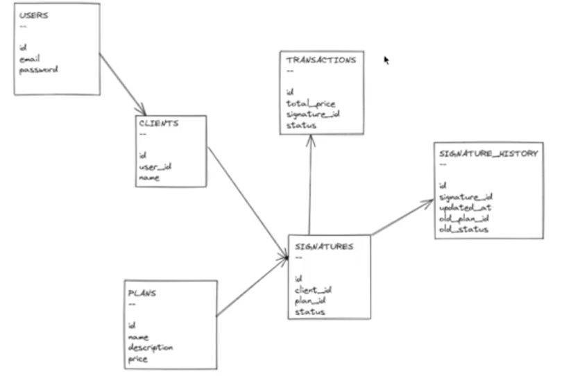

## Primeiro Projeto Feito no Curso
- A ideia é criar um projeto que trabalhe com assinaturas e multiplos usuarios.
- Da maneira na qual as tabelas estão construidas, estamos versionando o historico de assinaturas de um usuario por exemplo.
- 
- Boas Práticas Utilizadas Neste Projeto: 
- Fat Models, Skinny Controllers: Lógica de Negócio centralizada nas nossas models
- Boas Práticas de Commit Para manter organização e boa semâmntica